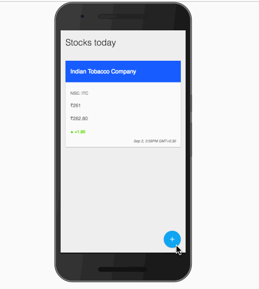

# stock-board-pwa
> A simple progressive webapp to display stock info.

__DEMO?__

Ofcourse! Have a look at the [DEMO](https://stock-board.surge.sh)!

__Why?__

This app is a result of the Google's [Launchpad-Build](https://events.withgoogle.com/launchpad-build-mumbai/) that happend at Mumbai on Sep-4-2016.

__What?__

This is a getting started repo for progressive webapp.

The app behaves like the below:

__What features does this app has?__

* Add to home screen.

* When offline, the screen goes grey :D

* Offline capabilites with service workers.

* Push notification. [No need of a server, just use push emulation for now.]

* Background sync.

__How do I run it?:__

* `git clone` the repo.

* Run a local server of your choice to server each phase as a root. 

* Go through to [commits](https://github.com/hemanth/stock-board-pwa/commits/master) for more info.

__P.S:__

This app is meant to get a feel and understand of progressive webapps, for production apps, it's adviced to use something like `sw-toolbox` or similar.

__P.P.S:__

Thanks to [malkani_faiz](https://twitter.com/malkani_faiz) for UX review and [gokul_i](https://twitter.com/gokul_i) for the shining the logo! 

